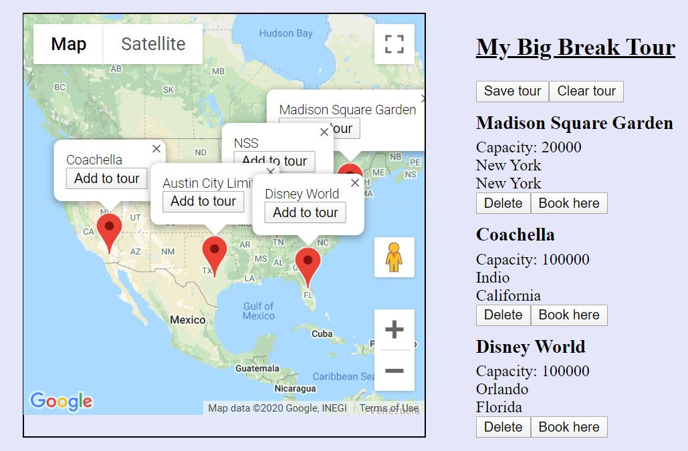

# Hit the Road


Hit the Road is a travel planning and messaging application designed for bands and music venues.

## Installation

Install react packages:

```bash
npx create-react-app 
npm i --save react-router-dom
npm install react-google-maps
npm install react-infinite-calendar

Generate a Google Maps API key:
https://developers.google.com/maps/documentation/javascript/get-api-key
and place it in the first script tag in index.html
<script src="https://maps.googleapis.com/maps/api/js?key=APIKEY" ></script>

npm start from the root directory to run application
```


## Features / Functionality
1. Login/register as a new user
1. Choose from two different types of users (band/venue)
1. Create a profile, and selectively make some of it public
1. Edit a profile (band/venue)
1. Build Tour from Google Map of music venues (band)
1. Use calendar to send booking inquiries as private messages to venues (band)
1. Reply to messages (band/venue)
1. View saved tours
1. State of draft tours saved across pages

## Database sample
Run a json server watching database.json on port 8088

```JSON
{
  "users": [
    {
      "email": "nss@gmail.com",
      "password": "123",
      "username": "NSS",
      "userType": "venue",
      "id": 1,
      "name": "NSS",
      "capacity": "100",
      "address": "",
      "city": "Nashville",
      "state": "Tennessee",
      "address2": "",
      "zip": "",
      "website": "",
      "facebook": "",
      "instagram": "",
      "twitter": "",
      "blurb": "",
      "size": "",
      "bandcamp": "",
      "youtube": "",
      "spotify": ""
    },
    {
      "email": "msg@me.com",
      "password": "123",
      "username": "msg",
      "userType": "venue",
      "id": 2,
      "name": "Madison Square Garden",
      "capacity": "20000",
      "address": "",
      "city": "New York",
      "state": "New York",
      "address2": "",
      "zip": "",
      "website": "",
      "facebook": "",
      "instagram": "",
      "twitter": "",
      "blurb": "",
      "size": "",
      "bandcamp": "",
      "youtube": "",
      "spotify": ""
    },
    {
      "email": "coachella@me.com",
      "password": "123",
      "username": "coachella",
      "userType": "venue",
      "id": 3,
      "name": "Coachella",
      "capacity": "100000",
      "address": "",
      "city": "Indio",
      "state": "California",
      "address2": "",
      "zip": "",
      "website": "",
      "facebook": "",
      "instagram": "",
      "twitter": "",
      "blurb": "",
      "size": "",
      "bandcamp": "",
      "youtube": "",
      "spotify": ""
    },
    {
      "email": "acl@me.com",
      "password": "123",
      "username": "acl",
      "userType": "venue",
      "id": 4,
      "name": "Austin City Limits",
      "capacity": "2750",
      "address": "",
      "city": "Austin",
      "state": "Texas",
      "address2": "",
      "zip": "",
      "website": "",
      "facebook": "",
      "instagram": "",
      "twitter": "",
      "blurb": "",
      "size": "",
      "bandcamp": "",
      "youtube": "",
      "spotify": ""
    },
    {
      "email": "disneyworld@me.com",
      "password": "123",
      "username": "disneyworld",
      "userType": "venue",
      "id": 5,
      "name": "Disney World",
      "capacity": "100000",
      "address": "",
      "city": "Orlando",
      "state": "Florida",
      "address2": "",
      "zip": "",
      "website": "",
      "facebook": "",
      "instagram": "",
      "twitter": "",
      "blurb": "",
      "size": "",
      "bandcamp": "",
      "youtube": "",
      "spotify": ""
    },
    {
      "email": "cohort37@me.com",
      "password": "123",
      "username": "cohort37",
      "userType": "band",
      "id": 6,
      "name": "Cohort 37",
      "size": "25",
      "city": "Nashville",
      "state": "Tennessee",
      "website": "",
      "bandcamp": "",
      "youtube": "",
      "facebook": "",
      "instagram": "",
      "twitter": "",
      "spotify": "",
      "blurb": "",
      "address2": "",
      "address2Public": "",
      "zip": "",
      "zipPublic": "",
      "capacity": "",
      "allAges": "",
      "address": "",
      "addressPublic": ""
    }
  ],
  "messages": [],
  "conversations": [],
  "conversationsMessages": [],
  "tours": [
    {
      "bandId": 6,
      "name": "My Big Break Tour",
      "saved": true,
      "id": 1
    },
    {
      "bandId": 6,
      "name": "My 1 Stop Tour",
      "saved": true,
      "id": 2
    }
  ],
  "bookings": [
    {
      "bandId": 6,
      "venueId": 3,
      "name": "Coachella",
      "id": 1
    },
    {
      "bandId": 6,
      "venueId": 5,
      "name": "Disney World",
      "id": 2
    },
    {
      "bandId": 6,
      "venueId": 2,
      "name": "Madison Square Garden",
      "id": 3
    },
    {
      "bandId": 6,
      "venueId": 2,
      "name": "Madison Square Garden",
      "id": 4
    }
  ],
  "bookingsTours": [
    {
      "bandId": 6,
      "venueId": 3,
      "bookingId": 1,
      "tourId": 1,
      "bookingName": "Coachella",
      "tourName": "My Big Break Tour",
      "id": 1
    },
    {
      "bandId": 6,
      "venueId": 5,
      "bookingId": 2,
      "tourId": 1,
      "bookingName": "Disney World",
      "tourName": "My Big Break Tour",
      "id": 2
    },
    {
      "bandId": 6,
      "venueId": 2,
      "bookingId": 3,
      "tourId": 1,
      "bookingName": "Madison Square Garden",
      "tourName": "My Big Break Tour",
      "id": 3
    },
    {
      "bandId": 6,
      "venueId": 2,
      "bookingId": 4,
      "tourId": 2,
      "bookingName": "Madison Square Garden",
      "tourName": "My 1 Stop Tour",
      "id": 4
    }
  ],
  "addresses": [
    {
      "userId": 1,
      "name": "NSS",
      "address": {
        "lat": 36.1626638,
        "lng": -86.7816016
      },
      "id": 1
    },
    {
      "userId": 2,
      "name": "Madison Square Garden",
      "address": {
        "lat": 40.650732,
        "lng": -73.946412
      },
      "id": 2
    },
    {
      "userId": 3,
      "name": "Coachella",
      "address": {
        "lat": 33.7205771,
        "lng": -116.2155619
      },
      "id": 3
    },
    {
      "userId": 4,
      "name": "Austin City Limits",
      "address": {
        "lat": 30.267153,
        "lng": -97.7430608
      },
      "id": 4
    },
    {
      "userId": 5,
      "name": "Disney World",
      "address": {
        "lat": 28.5383355,
        "lng": -81.3792365
      },
      "id": 5
    }
  ]
}
```

## Authors
William Green

## Thank You's
[NSS](http://nashvillesoftwareschool.com/)